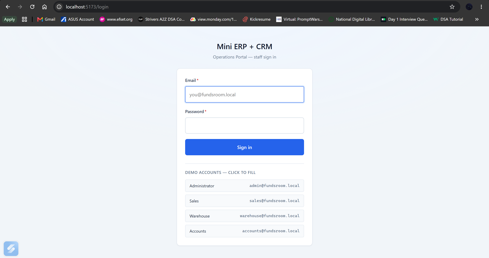
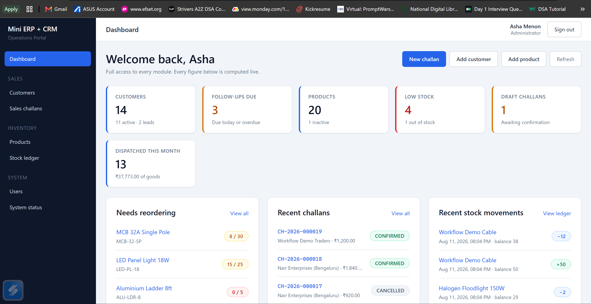
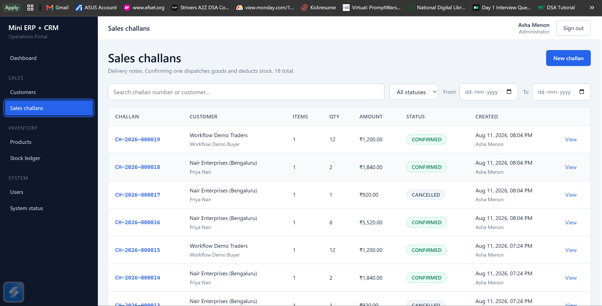
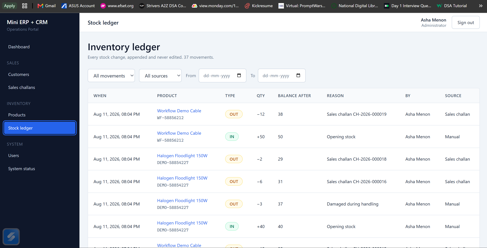

# Mini ERP + CRM Operations Portal

An internal operations portal for a wholesale / distribution company: customer CRM, product master,
inventory with a full stock-movement ledger, and sales challans with transactional stock deduction.

Built as Full Stack System. **Complete** — all four modules, 29 API routes,
249 automated tests passing, and a Postman collection with 144 assertions over the live API.

> **Reviewing this?** [SUBMISSION.md](SUBMISSION.md) maps every case-study requirement to the code
> that satisfies it, and has a ten-minute evaluation path. This README is for running it.

**What it does.** Four employee roles sign in and share one operational picture: the customers they
sell to, the products in the warehouse, every stock movement, and the sales challans raised against
customers. The guarantee the whole design serves is a narrow one —

> **Recorded stock and the movement log can never disagree, and stock can never go negative.**

Everything else follows from it: stock changes only through a logged movement, confirming a challan
deducts every line in one all-or-nothing transaction, challan lines carry a frozen snapshot of what
was sold at what price, and products are deactivated rather than deleted so old documents still read
correctly.

---

## Technology stack

**Backend** Node.js 20+ · TypeScript (strict) · Express 5 · PostgreSQL via `pg` with hand-written SQL · Zod · JWT · bcrypt  
**Frontend** React 18 · TypeScript · Vite 6 · React Router · axios · plain CSS with design tokens  
**Database** PostgreSQL 16/17  
**Deployment** Vercel (frontend) · Render (backend) · Neon (PostgreSQL) — all free tiers  

No ORM: the SQL is hand-written, because the interesting part of this project is a transaction with
explicit row locks in a deliberate order, and that is exactly what an ORM makes harder to read. The
reasoning is in [docs/ARCHITECTURE.md](docs/ARCHITECTURE.md).

---

## Screenshots



*Sign-in. Each role is a one-click chip, so a reviewer can switch between Admin, Sales, Warehouse and
Accounts without retyping credentials — and see the permission differences immediately.*



*The dashboard. Every counter is an aggregate computed live from the tables it describes — nothing
here is cached or denormalised — and each panel links to the records behind it. "Needs reordering"
shows current stock against the alert threshold; "Dispatched this month" is measured on the
confirmation date, so a challan drafted last month and confirmed this month counts here.*



*Sales challans. Numbers are issued server-side as `CH-YYYY-NNNNNN`, and the status column shows the
lifecycle in practice — confirmed documents have dispatched goods and deducted stock; cancelled ones
never touched it. Filters are held in the URL, so a filtered list is a shareable link.*



*The stock ledger — "every stock change, appended and never edited". Each row carries the balance
**after** it, so the stock level at any past moment is readable straight off the row. The `Source`
column separates manual adjustments ("Damaged during handling") from the `OUT` rows written
automatically by confirming a challan, each naming the challan that caused it.*

---

## Repository structure

```text
mini-erp-crm/
├── backend/
│   ├── scripts/
│   │   ├── copy-assets.mjs          copies .sql migrations into dist/ after tsc
│   │   └── test.mjs                 provisions an isolated test database, then runs node --test
│   ├── src/
│   │   ├── config/                  env.ts (validated config), db.ts (pool + withTransaction),
│   │   │                            permissions.ts (the role matrix, in executable form)
│   │   ├── controllers/             HTTP layer — no business logic
│   │   ├── services/                business rules and transactions
│   │   ├── repositories/            all SQL, one module per table
│   │   ├── validators/              Zod schemas; the inferred type IS the DTO
│   │   ├── middleware/              authenticate, authorize, validate, errorHandler, notFound
│   │   ├── routes/                  route table, mounted under /api
│   │   ├── db/
│   │   │   ├── migrations/          numbered, forward-only .sql files
│   │   │   ├── migrate.ts           migration runner
│   │   │   └── seed.ts              idempotent development seed
│   │   ├── tests/                   integration tests + helpers (harness, fixtures)
│   │   ├── types/                   domain enums shared across layers
│   │   ├── utils/                   AppError, httpResponse, logger, password, jwt, pagination, sql
│   │   ├── app.ts                   express assembly
│   │   └── server.ts                entry point, graceful shutdown
│   ├── .env.example
│   ├── Dockerfile                   multi-stage; runtime image has no compiler or tests
│   ├── package.json
│   ├── tsconfig.json
│   └── tsconfig.build.json          production build — excludes the test suite from dist/
├── frontend/
│   ├── src/
│   │   ├── api/                     axios instance + one module per resource
│   │   ├── components/ui/           Button, Field, Pagination, StatTile, States
│   │   ├── config/                  env.ts — the only reader of import.meta.env
│   │   ├── context/                 AuthContext — the app's only global state
│   │   ├── hooks/                   useApi (loading / error / data), useDebounce
│   │   ├── layouts/                 AppLayout — sidebar, top bar, content outlet
│   │   ├── pages/                   one folder per screen
│   │   ├── routes/                  ProtectedRoute, RoleRoute
│   │   ├── styles/                  tokens.css (design tokens), global.css
│   │   ├── types/                   API contract types
│   │   ├── utils/                   format.ts — dates and money, in one place
│   │   ├── App.tsx                  route table
│   │   └── main.tsx
│   ├── .env.example
│   ├── Dockerfile                   builds the SPA, then serves it with nginx
│   ├── index.html
│   ├── nginx.conf                   SPA fallback, caching and security headers
│   ├── package.json
│   ├── vercel.json                  SPA rewrite + asset caching for Vercel
│   └── vite.config.ts
├── docs/
├── postman/
│   ├── Mini-ERP-CRM.postman_collection.json    9 folders, 56 requests, 144 assertions
│   ├── Mini-ERP-CRM.postman_environment.json
│   ├── build-collection.mjs         generates both files — the JSON is not hand-edited
│   └── README.md
├── docker-compose.yml               the whole stack locally: postgres + api + web
├── render.yaml                      Render Blueprint for the backend service
├── .env.example                     system-wide variable reference
├── .gitignore
└── README.md
```

---

## Quick start with Docker

Nothing installed but Docker? The whole stack — database, API and web app — comes up with one
command, migrated and seeded:

```bash
docker compose up --build
```

| | Where it is |
| --- | --- |
| App | <http://localhost:8080> |
| API | <http://localhost:4000/api/health> |
| PostgreSQL | `localhost:5433` (user `postgres`, password `postgres`, database `mini_erp_crm`) |

Sign in with `admin@fundsroom.local` / `Admin@12345`.

> **Under Docker the app is on 8080, not 5173.** Port 5173 is the Vite dev server, and it only
> exists while `npm run dev` is running — Docker builds the SPA and serves it through nginx on 8080
> instead. If you have been developing locally, 5173 is the address you are used to, and it will be
> dead here; that is expected, not a broken container. Plain `http://localhost` with no port serves
> nothing either, because nothing is published on port 80 — the port is always required.

Details, port overrides and troubleshooting: [docs/DOCKER.md](docs/DOCKER.md). To develop with hot
reload, use the local setup below instead.

---

## Local setup

### Prerequisites

- **Node.js 20 or newer** (`node --version`)
- **PostgreSQL 14 or newer** running locally, *or* a free hosted database
  ([Neon](https://neon.tech), Supabase, Render Postgres). Nothing in the project is
  installation-specific — it only needs a connection string.

### 1. Clone and install

```bash
git clone https://github.com/<your-username>/Fundsroom_Assessment.git
cd Fundsroom_Assessment

cd backend  && npm install && cd ..
cd frontend && npm install && cd ..
```

### 2. Create the database

**Local PostgreSQL** — from a terminal that has `psql` on its PATH (on a default Windows install
that is `C:\Program Files\PostgreSQL\17\bin`; adjust for your install directory):

```bash
createdb -U postgres mini_erp_crm
# or, equivalently:
psql -U postgres -c "CREATE DATABASE mini_erp_crm;"
```

**Hosted (Neon / Supabase / Render)** — create a project in the provider's dashboard and copy the
connection string it gives you. No `createdb` step is needed.

### 3. Configure environment variables

```bash
cd backend  && cp .env.example .env
cd ../frontend && cp .env.example .env
```

Then edit `backend/.env`:

| Variable | What to put in it |
| --- | --- |
| `DATABASE_URL` | `postgresql://postgres:<your-password>@localhost:5432/mini_erp_crm`, or the connection string from your provider |
| `DATABASE_SSL` | `false` for a local install, `true` for any hosted provider |
| `JWT_SECRET` | A long random string. Generate one: `node -e "console.log(require('crypto').randomBytes(48).toString('base64url'))"` |
| `CORS_ORIGINS` | `http://localhost:5173` for local development |

`frontend/.env` normally needs no change for local development; it points at
`http://localhost:4000/api`.

Both `.env` files are git-ignored. Only the `.env.example` files are ever committed —
see [Environment variables](#environment-variables) below.

### 4. Create the tables and seed development data

```bash
cd backend
npm run db:setup     # = npm run migrate && npm run seed
```

`migrate` applies every pending file in `src/db/migrations/` inside a transaction and records it in
`schema_migrations`; re-running it is a no-op. `seed` inserts four users, seven customers and ten
products, and is idempotent — running it twice does not duplicate anything.

You can run the two steps separately (`npm run migrate`, `npm run seed`) if you prefer.

### 5. Start both applications

Two terminals:

```bash
# terminal 1
cd backend && npm run dev      # http://localhost:4000

# terminal 2
cd frontend && npm run dev     # http://localhost:5173
```

Open <http://localhost:8080> — the Vite dev server. This is the local-development address only; the
Docker stack serves the same app on **8080** instead, because there the SPA is a built bundle behind
nginx rather than a dev server. Running both at once is fine, and they are independent.

You land on the sign-in screen; pick any of the role chips below it to
sign in with one click. The dashboard then opens with live counters — customers, follow-ups due,
low stock, draft challans and this month's dispatches — each one linking to the records behind it.

If anything looks wrong, **System status** in the sidebar shows whether the API and database are
reachable and tells you exactly what to check.

You can also verify the API directly:

```bash
curl http://localhost:4000/api/health
```

### Exploring the API

Import `postman/Mini-ERP-CRM.postman_collection.json` and its environment file, run
**Auth → Login (admin)**, and the rest of the collection is authenticated automatically. The
**Workflow (end-to-end)** folder walks the whole story — customer → product → challan → confirm →
stock falls → ledger explains why — in eight requests. See [postman/README.md](postman/README.md).

Or run it headless:

```bash
npx newman run postman/Mini-ERP-CRM.postman_collection.json \
  -e postman/Mini-ERP-CRM.postman_environment.json
```

The full endpoint reference is [docs/API_DOCUMENTATION.md](docs/API_DOCUMENTATION.md).

---

## Development credentials

Created by `npm run seed`. These are **throwaway demo accounts for a development database**, not
secrets — the case study requires working test logins for every role. The passwords come from the
`SEED_*_PASSWORD` variables in `backend/.env`; the values below are the documented defaults used
when those variables are absent.

| Role | Email | Default password |
| --- | --- | --- |
| Admin | `admin@fundsroom.local` | `Admin@12345` |
| Sales | `sales@fundsroom.local` | `Sales@12345` |
| Warehouse | `warehouse@fundsroom.local` | `Warehouse@12345` |
| Accounts | `accounts@fundsroom.local` | `Accounts@12345` |

Passwords are bcrypt-hashed before they reach the database; no plaintext is ever stored. The seed
script refuses to run when `NODE_ENV=production` unless `ALLOW_PRODUCTION_SEED=true` is set
explicitly, so these defaults cannot be created on a production database by accident.

On the sign-in screen each account is available as a one-click chip, so you can switch roles without
retyping credentials.

---

## Available scripts

**Backend** (`cd backend`)

| Command | What it does |
| --- | --- |
| `npm run dev` | Start with hot reload (tsx watch) |
| `npm run build` | Compile TypeScript to `dist/` and copy the `.sql` migrations across |
| `npm start` | Run the compiled build (production) |
| `npm test` | Run the 231 integration tests against an isolated `<database>_test` database |
| `npm run typecheck` | Type-check without emitting |
| `npm run migrate` | Apply pending migrations |
| `npm run seed` | Insert development seed data |
| `npm run db:setup` | Migrate, then seed |

**Frontend** (`cd frontend`)

| Command | What it does |
| --- | --- |
| `npm run dev` | Vite dev server on port 5173 |
| `npm run build` | Type-check, then build to `dist/` |
| `npm run preview` | Serve the production build locally |
| `npm test` | Run the 18 unit tests over the pure utilities |
| `npm run typecheck` | Type-check the app and the tests |

---

## Environment variables

Every variable is documented with safe placeholders in [.env.example](.env.example) (system-wide),
[backend/.env.example](backend/.env.example) and [frontend/.env.example](frontend/.env.example).

How they are managed:

- **Local** — real values live in `backend/.env` and `frontend/.env`, both git-ignored. The
  `.gitignore` ignores `.env` and `.env.*` and then re-includes `!.env.example`, so an example file
  is committed and a real one cannot be.
- **Backend loading** — `src/config/env.ts` is the only module that reads `process.env`. It
  validates everything with Zod at boot and **exits with a readable message** if a variable is
  missing or malformed, rather than failing later with an obscure error.
- **Frontend loading** — `src/config/env.ts` is the only module that reads `import.meta.env`. Vite
  inlines `VITE_*` variables into the built bundle, so they are public by definition and never hold
  a secret.
- **Production** — values are set in the hosting provider's dashboard (Render for the backend,
  Vercel for the frontend), never in a file. Every variable is tabulated per platform in
  [docs/DEPLOYMENT.md](docs/DEPLOYMENT.md) §8.

---

## Deployment

Neon (PostgreSQL) → Render (API) → Vercel (SPA), all on free tiers, **in that order** — each step
needs a value the previous one produces. The repository carries the configuration:

| File | What it does |
| --- | --- |
| [render.yaml](render.yaml) | Render Blueprint: build and start commands, `/api/health` as the health check, and every environment variable, with secrets marked `sync: false` |
| [frontend/vercel.json](frontend/vercel.json) | Rewrites every path to `index.html` — without it, refreshing `/customers/12` 404s, because the app uses `BrowserRouter` — plus immutable caching for hashed assets |
| [backend/tsconfig.build.json](backend/tsconfig.build.json) | Keeps the test suite out of `dist/` |

Migrations run from the start command, so a deploy applies its own schema changes; the API verifies
the database is reachable before it listens, so a bad `DATABASE_URL` fails the deploy instead of
serving 500s.

Two things catch everyone, and both are covered in the guide: `VITE_API_BASE_URL` is **compiled into
the bundle**, so changing it needs a rebuild rather than a restart; and `CORS_ORIGINS` on Render must
name the Vercel origin exactly, or the browser is blocked while Postman keeps working.

Full walkthrough, per-platform variable tables, verification commands and a troubleshooting table:
**[docs/DEPLOYMENT.md](docs/DEPLOYMENT.md)**.

---

## Documentation

| Document | What it covers |
| --- | --- |
| [docs/PROJECT_OVERVIEW.md](docs/PROJECT_OVERVIEW.md) | What the portal is, who uses it, the business problem, modules, workflows, assumptions, MVP scope, future work |
| [docs/ARCHITECTURE.md](docs/ARCHITECTURE.md) | System / frontend / backend / database architecture, auth flow, request flow, error handling, role permission matrix |
| [docs/DATABASE_DESIGN.md](docs/DATABASE_DESIGN.md) | Every table, column, key, constraint and index, plus the reference DDL and the seed-data plan |
| [docs/API_PLAN.md](docs/API_PLAN.md) | The Phase 0 plan: 26 planned endpoints, conventions, response envelope, error codes, validation rules |
| [docs/AUTHENTICATION.md](docs/AUTHENTICATION.md) | JWT design, login flow, password storage, **permission matrix**, security decisions and limitations, 21 test results |
| [docs/CRM_MODULE.md](docs/CRM_MODULE.md) | Customer workflow, data model, endpoints, validation, role access, frontend behaviour, 31 test results |
| [docs/INVENTORY_MODULE.md](docs/INVENTORY_MODULE.md) | Product master, the stock-only-moves-through-the-ledger rule, transaction & row-locking design, low-stock logic, 25 test results plus a concurrency proof |
| [docs/SALES_CHALLAN_MODULE.md](docs/SALES_CHALLAN_MODULE.md) | Challan lifecycle, draft vs confirmed, the two-pass transactional stock deduction, **product snapshot**, challan numbering, 41 test results plus a concurrency proof |
| [docs/FRONTEND_GUIDE.md](docs/FRONTEND_GUIDE.md) | The dashboard (what every counter means and why), frontend architecture, the four-states and URL-as-filter-state conventions, navigation, accessibility, 17 test results |
| [docs/TESTING.md](docs/TESTING.md) | How to run the suite, why it is integration-first, coverage by area, the concurrency and snapshot proofs, **the five defects found and fixed**, and what is deliberately not covered |
| [docs/API_DOCUMENTATION.md](docs/API_DOCUMENTATION.md) | The implemented API reference: all 29 routes, every request and response captured from the running API, the full error catalogue, the permission matrix, and an honest diff against the Phase 0 plan |
| [docs/DEPLOYMENT.md](docs/DEPLOYMENT.md) | Putting it online on free tiers: Neon → Render → Vercel in order, why that split, every environment variable per platform, how to verify the deployment end to end, and a troubleshooting table for the failures that actually happen |
| [docs/DOCKER.md](docs/DOCKER.md) | Running the whole stack in containers: what each image contains, start-up ordering, port overrides, and the build-time-vs-runtime trap with the API URL |
| [postman/README.md](postman/README.md) | The collection folder by folder, how to re-run it, and how it is regenerated |
| [SUBMISSION.md](SUBMISSION.md) | **For reviewers** — requirement-to-code map, a ten-minute evaluation path, the decisions taken and what is deliberately absent |

`docs/API_PLAN.md` is the Phase 0 *plan*, left unedited as a record of what was agreed before any
handler was written. For what was actually built, read `docs/API_DOCUMENTATION.md`; its §11 lists
every divergence between the two and why.

---

## Build phases

| Phase | Scope | Status |
| --- | --- | --- |
| 0 | Analysis, architecture, database design, API plan | ✅ Complete |
| 1 | Backend + frontend scaffolding, migrations, seed data | ✅ Complete |
| 2 | Authentication and role-based access | ✅ Complete |
| 3 | Customer CRM module | ✅ Complete |
| 4 | Products, inventory and stock movements | ✅ Complete |
| 5 | Sales challans with transactional stock deduction | ✅ Complete |
| 6 | Dashboard and complete frontend UX | ✅ Complete |
| 7 | Testing, validation and bug fixing | ✅ Complete |
| 8 | API documentation and Postman collection | ✅ Complete |
| 9 | Deployment | ✅ Complete |
| 10 | Final documentation and submission preparation | ✅ Complete |

Each phase was committed separately, so the history reads as a build rather than a single dump.
