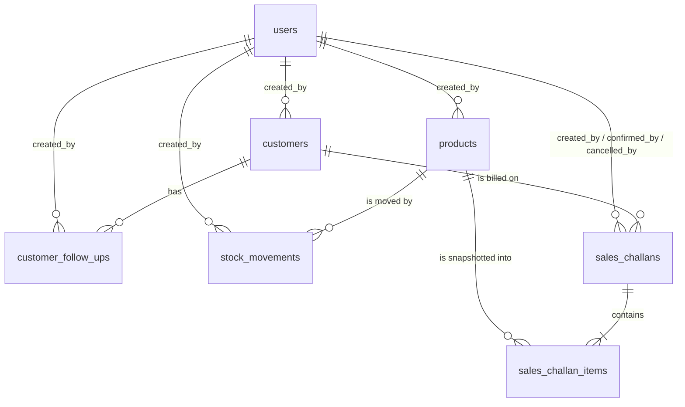

# Database Design — Mini ERP + CRM Operations Portal

> Phase 0 deliverable. PostgreSQL 16. The DDL below is the design contract; it is implemented
> verbatim as `backend/src/db/migrations/001_init.sql` in Phase 1.

---

## 1. Entity–relationship overview



Seven tables (plus one bookkeeping table for migrations):

| # | Table | Purpose | Grows |
| --- | --- | --- | --- |
| 1 | `users` | Employee accounts and roles | Rarely |
| 2 | `customers` | Customer / lead master (CRM) | Slowly |
| 3 | `customer_follow_ups` | Append-only CRM follow-up note history | Continuously |
| 4 | `products` | Product master + the authoritative `current_stock` | Slowly |
| 5 | `stock_movements` | Append-only inventory ledger | Continuously |
| 6 | `sales_challans` | Challan header + lifecycle status | Continuously |
| 7 | `sales_challan_items` | Challan lines **with a product snapshot** | Continuously |
| — | `schema_migrations` | Which migration files have been applied | — |

**Why `customer_follow_ups` is a separate table rather than a text column.** The case study requires
both a `notes` field on the customer *and* the feature "add follow-up notes". Those are two different
things: `customers.notes` is a standing description of the account, while a follow-up is an event
that happened on a date, performed by a specific user. Appending events into a single text column
loses the author, the timestamp, and the ability to list "follow-ups due this week". This is the only
entity added beyond the six the brief names, and it exists because a required feature needs it.

---

## 2. Conventions applied to every table

| Convention | Decision | Reason |
| --- | --- | --- |
| Primary key | `BIGSERIAL PRIMARY KEY` named `id` | Simple, sortable, index-friendly, and readable in URLs. UUIDs would buy nothing here. |
| Timestamps | `created_at TIMESTAMPTZ NOT NULL DEFAULT now()`, and `updated_at` on mutable tables | Timezone-aware, stored UTC, rendered locally. |
| `updated_at` maintenance | Shared `set_updated_at()` trigger | A `UPDATE` cannot forget to bump it. |
| Enumerations | `TEXT` + `CHECK (col IN (...))` | Extending a value is a one-line migration; native `ENUM` needs `ALTER TYPE`. Reads plainly in `psql` and maps 1:1 to a Zod enum. |
| Money | `NUMERIC(12,2)` (line totals `NUMERIC(14,2)`) | Exact decimal arithmetic. Never `FLOAT`. |
| Quantities | `INTEGER` with `CHECK` bounds | Whole units only (assumption A3). |
| Text | `TEXT` with `CHECK (length(...) <= n)` where a bound is meaningful | Postgres `TEXT` and `VARCHAR(n)` perform identically; a `CHECK` keeps the limit explicit and easy to change. |
| Deletes | Soft (`deleted_at`) for customers, deactivation (`is_active`) for products and users | History must survive. Ledger and challan tables are never deleted from. |
| FK policy | `ON DELETE RESTRICT` by default; `CASCADE` only for rows that cannot exist alone | Prevents silent loss of history. |
| Naming | `snake_case`, plural tables, `<entity>_id` foreign keys | Predictable. |

---

## 3. Table definitions

### 3.1 `users`

Employee accounts. Seeded, not self-registered (assumption A7).

| Column | Type | Constraints | Notes |
| --- | --- | --- | --- |
| `id` | `BIGSERIAL` | PK | |
| `name` | `TEXT` | NOT NULL, length 2–120 | Display name |
| `email` | `TEXT`¹ | NOT NULL, **UNIQUE on `lower(email)`** | Login identifier, case-insensitive |
| `password_hash` | `TEXT` | NOT NULL | bcrypt, cost 10. Never selected into a response |
| `role` | `TEXT` | NOT NULL, CHECK IN (`ADMIN`,`SALES`,`WAREHOUSE`,`ACCOUNTS`) | |
| `is_active` | `BOOLEAN` | NOT NULL DEFAULT `true` | Inactive users cannot log in |
| `created_at` / `updated_at` | `TIMESTAMPTZ` | NOT NULL DEFAULT `now()` | |

¹ Case-insensitive uniqueness (so `Admin@x.com` and `admin@x.com` cannot both exist) comes from
`CREATE UNIQUE INDEX uq_users_email_lower ON users (lower(email))`, not from the `citext` extension.
**Revised in Phase 1:** `CREATE EXTENSION citext` needs privileges that not every managed provider
grants on a free tier, and a failed extension install would break the very first migration. A
functional unique index needs no extension, works identically on a laptop and on Neon/Render/Supabase,
and the service layer lower-cases emails before storing them anyway.

---

### 3.2 `customers`

Every field required by the case study, plus provenance and soft deletion.

| Column | Type | Constraints | Notes |
| --- | --- | --- | --- |
| `id` | `BIGSERIAL` | PK | |
| `name` | `TEXT` | NOT NULL, length 2–120 | Contact person / customer name |
| `mobile` | `TEXT` | NOT NULL, **UNIQUE**, CHECK `~ '^[0-9]{10,15}$'` | Digits only; the practical business key (assumption A6) |
| `email` | `TEXT` | NOT NULL, CHECK simple email pattern | Not unique — a business may share one mailbox |
| `business_name` | `TEXT` | NOT NULL, length 2–150 | |
| `gst_number` | `TEXT` | NULL, CHECK 15-char GSTIN pattern when present | **Optional**, per the brief |
| `customer_type` | `TEXT` | NOT NULL, CHECK IN (`RETAIL`,`WHOLESALE`,`DISTRIBUTOR`) | |
| `address` | `TEXT` | NOT NULL, length ≤ 500 | |
| `status` | `TEXT` | NOT NULL DEFAULT `LEAD`, CHECK IN (`LEAD`,`ACTIVE`,`INACTIVE`) | |
| `follow_up_date` | `DATE` | NULL | A calendar day, not an instant — hence `DATE` |
| `notes` | `TEXT` | NULL, length ≤ 2000 | Standing notes about the account |
| `created_by` | `BIGINT` | NOT NULL, FK → `users(id)` ON DELETE RESTRICT | |
| `deleted_at` | `TIMESTAMPTZ` | NULL | Soft delete (assumption A10); all reads filter `deleted_at IS NULL` |
| `created_at` / `updated_at` | `TIMESTAMPTZ` | NOT NULL DEFAULT `now()` | |

GSTIN pattern used: `^[0-9]{2}[A-Z]{5}[0-9]{4}[A-Z]{1}[1-9A-Z]{1}Z[0-9A-Z]{1}$` — format validation
only; there is no checksum or government lookup.

---

### 3.3 `customer_follow_ups`

Append-only CRM activity log.

| Column | Type | Constraints | Notes |
| --- | --- | --- | --- |
| `id` | `BIGSERIAL` | PK | |
| `customer_id` | `BIGINT` | NOT NULL, FK → `customers(id)` **ON DELETE CASCADE** | A note cannot outlive its customer |
| `note` | `TEXT` | NOT NULL, length 1–2000 | What was discussed |
| `next_follow_up_date` | `DATE` | NULL | When set, the service also updates `customers.follow_up_date` |
| `created_by` | `BIGINT` | NOT NULL, FK → `users(id)` ON DELETE RESTRICT | Who made the call |
| `created_at` | `TIMESTAMPTZ` | NOT NULL DEFAULT `now()` | No `updated_at` — notes are never edited |

---

### 3.4 `products`

The product master. `current_stock` here is the single authoritative stock figure (assumption A2).

| Column | Type | Constraints | Notes |
| --- | --- | --- | --- |
| `id` | `BIGSERIAL` | PK | |
| `name` | `TEXT` | NOT NULL, length 2–150 | |
| `sku` | `TEXT` | NOT NULL, **UNIQUE**, CHECK `~ '^[A-Za-z0-9_-]{2,50}$'` | Stored upper-cased by the service |
| `category` | `TEXT` | NOT NULL, length 2–80 | Free text in the MVP; a `categories` table would be premature |
| `unit_price` | `NUMERIC(12,2)` | NOT NULL, CHECK `>= 0` | |
| `current_stock` | `INTEGER` | NOT NULL DEFAULT 0, **CHECK `>= 0`** | ⚠️ The database-level guarantee against negative stock |
| `min_stock_alert` | `INTEGER` | NOT NULL DEFAULT 0, CHECK `>= 0` | Low-stock threshold |
| `location` | `TEXT` | NOT NULL, length ≤ 100 | Descriptive warehouse/rack label |
| `is_active` | `BOOLEAN` | NOT NULL DEFAULT `true` | Deactivated instead of deleted (assumption A11) |
| `created_by` | `BIGINT` | NOT NULL, FK → `users(id)` ON DELETE RESTRICT | |
| `created_at` / `updated_at` | `TIMESTAMPTZ` | NOT NULL DEFAULT `now()` | |

**Low stock** is the derived predicate `current_stock <= min_stock_alert`. It is computed in queries
rather than stored, so it can never fall out of sync.

**`current_stock` is never set directly by an update-product request.** The product form does not
expose it; it changes only through the stock-movement or challan-confirmation services, which write
the movement row and the new balance in the same transaction (assumption A13).

---

### 3.5 `stock_movements`

The inventory ledger. Append-only: rows are never updated or deleted (assumption A14).

| Column | Type | Constraints | Notes |
| --- | --- | --- | --- |
| `id` | `BIGSERIAL` | PK | |
| `product_id` | `BIGINT` | NOT NULL, FK → `products(id)` ON DELETE RESTRICT | |
| `movement_type` | `TEXT` | NOT NULL, CHECK IN (`IN`,`OUT`) | |
| `quantity` | `INTEGER` | NOT NULL, CHECK `> 0` | Always a positive magnitude; direction lives in `movement_type` |
| `reason` | `TEXT` | NOT NULL, length 3–255 | Mandatory — every movement must be explainable |
| `balance_after` | `INTEGER` | NOT NULL, CHECK `>= 0` | Product stock immediately after this row. Makes the ledger auditable without replaying it |
| `reference_type` | `TEXT` | NOT NULL DEFAULT `MANUAL`, CHECK IN (`MANUAL`,`SALES_CHALLAN`) | Where the movement came from |
| `reference_id` | `BIGINT` | NULL | `sales_challans.id` when `reference_type = 'SALES_CHALLAN'` |
| `created_by` | `BIGINT` | NOT NULL, FK → `users(id)` ON DELETE RESTRICT | Who performed it |
| `created_at` | `TIMESTAMPTZ` | NOT NULL DEFAULT `now()` | |

Table-level constraint: `CHECK ((reference_type = 'SALES_CHALLAN') = (reference_id IS NOT NULL))` —
a challan-sourced movement must name its challan, and a manual one must not.

`reference_type` is deliberately `NOT NULL`. A `CHECK` whose expression evaluates to `NULL` is
*satisfied* in SQL, so a nullable `reference_type` would let a row carry a `reference_id` with no
source type at all. Defaulting to `MANUAL` keeps the constraint two-valued and always enforced.

`reference_id` is intentionally **not** a foreign key: it is a polymorphic pointer that will also
serve purchase/return documents later. The MVP only ever writes challan ids into it, and the API
resolves them explicitly.

---

### 3.6 `sales_challans`

Challan header and lifecycle.

| Column | Type | Constraints | Notes |
| --- | --- | --- | --- |
| `id` | `BIGSERIAL` | PK | |
| `challan_number` | `TEXT` | NOT NULL, **UNIQUE** | Auto-generated, e.g. `CH-2026-000042` |
| `customer_id` | `BIGINT` | NOT NULL, FK → `customers(id)` ON DELETE RESTRICT | |
| `status` | `TEXT` | NOT NULL DEFAULT `DRAFT`, CHECK IN (`DRAFT`,`CONFIRMED`,`CANCELLED`) | |
| `total_quantity` | `INTEGER` | NOT NULL DEFAULT 0, CHECK `>= 0` | Sum of item quantities, recomputed on every write |
| `total_amount` | `NUMERIC(14,2)` | NOT NULL DEFAULT 0, CHECK `>= 0` | Sum of item line totals, at snapshot prices |
| `notes` | `TEXT` | NULL, length ≤ 1000 | Delivery instructions etc. |
| `created_by` | `BIGINT` | NOT NULL, FK → `users(id)` ON DELETE RESTRICT | |
| `confirmed_by` | `BIGINT` | NULL, FK → `users(id)` ON DELETE RESTRICT | |
| `confirmed_at` | `TIMESTAMPTZ` | NULL | |
| `cancelled_by` | `BIGINT` | NULL, FK → `users(id)` ON DELETE RESTRICT | |
| `cancelled_at` | `TIMESTAMPTZ` | NULL | |
| `created_at` / `updated_at` | `TIMESTAMPTZ` | NOT NULL DEFAULT `now()` | |

Table-level constraints tie the stamps to the status:

```sql
CHECK ((status = 'CONFIRMED') = (confirmed_at IS NOT NULL AND confirmed_by IS NOT NULL))
CHECK ((status = 'CANCELLED') = (cancelled_at IS NOT NULL AND cancelled_by IS NOT NULL))
```

`total_quantity` and `total_amount` are stored rather than derived on read. They are recomputed from
`sales_challan_items` inside the same transaction as any item change, so they cannot drift, and the
list screen does not need an aggregate join.

**Challan number generation.** A dedicated PostgreSQL sequence:

```sql
CREATE SEQUENCE challan_number_seq;
-- 'CH-' || to_char(now(),'YYYY') || '-' || lpad(nextval('challan_number_seq')::text, 6, '0')
```

`nextval` is atomic and non-blocking, so two users creating challans at the same instant can never
receive the same number — unlike a `SELECT max(...) + 1`, which races. The counter does not reset
each year (assumption A12); the `UNIQUE` index on `challan_number` is the final guarantee.

---

### 3.7 `sales_challan_items`

**The snapshot table — the most important design decision in the schema.**

| Column | Type | Constraints | Notes |
| --- | --- | --- | --- |
| `id` | `BIGSERIAL` | PK | |
| `challan_id` | `BIGINT` | NOT NULL, FK → `sales_challans(id)` **ON DELETE CASCADE** | Lines belong to their challan |
| `product_id` | `BIGINT` | NOT NULL, FK → `products(id)` ON DELETE RESTRICT | Live link, for "where was this sold?" |
| `product_name` | `TEXT` | NOT NULL | 📸 **Snapshot** — name at time of sale |
| `product_sku` | `TEXT` | NOT NULL | 📸 **Snapshot** — SKU at time of sale |
| `unit_price` | `NUMERIC(12,2)` | NOT NULL, CHECK `>= 0` | 📸 **Snapshot** — price at time of sale |
| `quantity` | `INTEGER` | NOT NULL, CHECK `> 0` | |
| `line_total` | `NUMERIC(14,2)` | `GENERATED ALWAYS AS (unit_price * quantity) STORED` | Cannot disagree with its inputs |
| `created_at` | `TIMESTAMPTZ` | NOT NULL DEFAULT `now()` | |
| — | | **UNIQUE `(challan_id, product_id)`** | One line per product per challan |

**Why the duplication is correct here.** Normalisation says "store `product_id` and join". That is
wrong for a commercial document. A challan is a record of *what was actually dispatched at what
price on that day*. If the warehouse renames `Copper Wire 2.5mm` to `Copper Wire 2.5sqmm` and raises
the price by 8%, a join-based challan would silently rewrite history and stop matching the printed
copy the customer signed. Snapshotting the three fields that appear on the document freezes it.
`product_id` is kept alongside so live analytics ("total units of this product ever dispatched")
still work.

---

### 3.8 `schema_migrations`

| Column | Type | Notes |
| --- | --- | --- |
| `id` | `SERIAL PRIMARY KEY` | |
| `filename` | `TEXT NOT NULL UNIQUE` | e.g. `001_init.sql` |
| `applied_at` | `TIMESTAMPTZ NOT NULL DEFAULT now()` | |

`migrate.ts` reads `db/migrations/*.sql` in filename order, skips those already recorded, and runs
each remaining file inside its own transaction, inserting the bookkeeping row in the same
transaction. Forward-only; there are no down-migrations (a rollback would be a new numbered file).

---

## 4. Relationships summary

| Parent | Child | Cardinality | FK action | Why |
| --- | --- | --- | --- | --- |
| `users` | `customers.created_by` | 1 : N | RESTRICT | Provenance must survive |
| `users` | `products.created_by` | 1 : N | RESTRICT | |
| `users` | `stock_movements.created_by` | 1 : N | RESTRICT | The ledger's "who" is not optional |
| `users` | `customer_follow_ups.created_by` | 1 : N | RESTRICT | |
| `users` | `sales_challans.created_by / confirmed_by / cancelled_by` | 1 : N (×3) | RESTRICT | |
| `customers` | `customer_follow_ups` | 1 : N | **CASCADE** | A note has no meaning without its customer |
| `customers` | `sales_challans` | 1 : N | RESTRICT | Dispatch history must not be destroyed |
| `products` | `stock_movements` | 1 : N | RESTRICT | |
| `products` | `sales_challan_items` | 1 : N | RESTRICT | |
| `sales_challans` | `sales_challan_items` | 1 : N (≥1 when confirmed) | **CASCADE** | Lines are part of the document |

---

## 5. Indexes

Beyond the automatic PK and `UNIQUE` indexes:

| Index | Table | Definition | Serves |
| --- | --- | --- | --- |
| `idx_customers_status` | `customers` | `(status) WHERE deleted_at IS NULL` | Status filter on the list screen |
| `idx_customers_type` | `customers` | `(customer_type) WHERE deleted_at IS NULL` | Type filter |
| `idx_customers_follow_up` | `customers` | `(follow_up_date) WHERE deleted_at IS NULL AND follow_up_date IS NOT NULL` | "Follow-ups due" queries and dashboard counter |
| `idx_customers_name_lower` | `customers` | `(lower(name))` | Case-insensitive name search |
| `idx_customers_business_lower` | `customers` | `(lower(business_name))` | Case-insensitive business search |
| `idx_customers_created_at` | `customers` | `(created_at DESC)` | Default list ordering |
| `idx_follow_ups_customer` | `customer_follow_ups` | `(customer_id, created_at DESC)` | Detail-page timeline |
| `idx_products_category` | `products` | `(category)` | Category filter |
| `idx_products_active` | `products` | `(is_active)` | Hiding deactivated products |
| `idx_products_name_lower` | `products` | `(lower(name))` | Name search |
| `idx_stock_moves_product` | `stock_movements` | `(product_id, created_at DESC)` | Per-product movement history |
| `idx_stock_moves_created_at` | `stock_movements` | `(created_at DESC)` | Global ledger view |
| `idx_stock_moves_reference` | `stock_movements` | `(reference_type, reference_id)` | "Which movements did this challan cause?" |
| `idx_challans_customer` | `sales_challans` | `(customer_id, created_at DESC)` | Customer detail page |
| `idx_challans_status` | `sales_challans` | `(status)` | Status filter and dashboard counters |
| `idx_challans_created_at` | `sales_challans` | `(created_at DESC)` | Default list ordering |
| `idx_challan_items_challan` | `sales_challan_items` | `(challan_id)` | Loading a challan's lines |

**Honest notes on search and low stock.** Text search uses `ILIKE '%term%'`, and a leading wildcard
cannot use a plain B-tree index — the `lower()` indexes only help prefix matches. Similarly, the
low-stock predicate compares two columns (`current_stock <= min_stock_alert`) and cannot be indexed
directly. At the data volume of a small distributor (thousands of rows) both are sequential scans of
a few milliseconds. The documented upgrade path is the `pg_trgm` extension with GIN indexes for
search; it is not adopted now because it would be optimising a problem that does not exist yet.

---

## 6. Business rules enforced by the database

These are the invariants that hold even if the application layer has a bug:

| # | Rule | Mechanism |
| --- | --- | --- |
| DB1 | **Stock can never be negative** | `products.current_stock CHECK (current_stock >= 0)` |
| DB2 | A stock movement always has a positive quantity and a direction | `CHECK (quantity > 0)`, `CHECK (movement_type IN ('IN','OUT'))` |
| DB3 | Every stock movement has a reason and an author | `reason NOT NULL` (min length 3), `created_by NOT NULL` FK |
| DB4 | A recorded balance can never be negative | `balance_after CHECK (>= 0)` |
| DB5 | Challan numbers are unique | `UNIQUE (challan_number)` + sequence-based generation |
| DB6 | Status values are closed sets | `CHECK … IN (…)` on `role`, `customer_type`, `status`, `movement_type` |
| DB7 | A confirmed/cancelled challan carries who did it and when | Paired `CHECK` constraints on status ↔ stamps |
| DB8 | One line per product per challan | `UNIQUE (challan_id, product_id)` |
| DB9 | A line total always equals price × quantity | `GENERATED ALWAYS AS … STORED` |
| DB10 | SKUs and customer mobiles are unique | `UNIQUE (sku)`, `UNIQUE (mobile)` |
| DB11 | History cannot be orphaned or silently deleted | `ON DELETE RESTRICT` on every historical FK |
| DB12 | Email addresses identify exactly one user account | `UNIQUE` on `citext` email (or `lower(email)`) |

Rules enforced in the **service** layer (they need multi-row reasoning the database cannot express):

| # | Rule |
| --- | --- |
| SVC1 | Confirming a challan checks **all** lines first and either applies every deduction or none — one transaction, `SELECT … FOR UPDATE` on the product rows, ordered by `product_id` to avoid deadlocks. |
| SVC2 | A Draft challan does not touch stock. Only the DRAFT → CONFIRMED transition deducts. |
| SVC3 | Legal transitions are only `DRAFT → CONFIRMED` and `DRAFT → CANCELLED`. Anything else is 409 `INVALID_STATE`. |
| SVC4 | A challan must have at least one line before it can be confirmed. |
| SVC5 | Line snapshots are taken from the product row **at confirmation time as well as at draft time**, so the price on a long-lived draft is refreshed when it is committed — and then frozen forever. |
| SVC6 | `total_quantity` / `total_amount` are recomputed from the lines on every item change. |
| SVC7 | Manual OUT movements are rejected before they would breach DB1, with a readable message rather than a constraint error. |
| SVC8 | A challan may only reference an `ACTIVE` (non-deleted) customer and `is_active` products. |
| SVC9 | Adding a follow-up with a `next_follow_up_date` also updates `customers.follow_up_date`. |

---

## 7. Reference DDL

Implemented as `backend/src/db/migrations/001_init.sql` in Phase 1.

```sql
CREATE OR REPLACE FUNCTION set_updated_at() RETURNS trigger AS $$
BEGIN NEW.updated_at = now(); RETURN NEW; END;
$$ LANGUAGE plpgsql;

-- 1. users ------------------------------------------------------------------
CREATE TABLE users (
  id            BIGSERIAL PRIMARY KEY,
  name          TEXT        NOT NULL CHECK (length(btrim(name)) BETWEEN 2 AND 120),
  email         TEXT        NOT NULL CHECK (email ~* '^[^@[:space:]]+@[^@[:space:]]+\.[a-z]{2,}$'),
  password_hash TEXT        NOT NULL,
  role          TEXT        NOT NULL CHECK (role IN ('ADMIN','SALES','WAREHOUSE','ACCOUNTS')),
  is_active     BOOLEAN     NOT NULL DEFAULT true,
  created_at    TIMESTAMPTZ NOT NULL DEFAULT now(),
  updated_at    TIMESTAMPTZ NOT NULL DEFAULT now()
);
CREATE UNIQUE INDEX uq_users_email_lower ON users (lower(email));
CREATE TRIGGER trg_users_updated BEFORE UPDATE ON users
  FOR EACH ROW EXECUTE FUNCTION set_updated_at();

-- 2. customers --------------------------------------------------------------
CREATE TABLE customers (
  id             BIGSERIAL PRIMARY KEY,
  name           TEXT        NOT NULL CHECK (length(btrim(name)) BETWEEN 2 AND 120),
  mobile         TEXT        NOT NULL UNIQUE CHECK (mobile ~ '^[0-9]{10,15}$'),
  email          TEXT        NOT NULL CHECK (email ~* '^[^@[:space:]]+@[^@[:space:]]+\.[a-z]{2,}$'),
  business_name  TEXT        NOT NULL CHECK (length(btrim(business_name)) BETWEEN 2 AND 150),
  gst_number     TEXT        NULL CHECK (
                   gst_number IS NULL OR
                   gst_number ~ '^[0-9]{2}[A-Z]{5}[0-9]{4}[A-Z]{1}[1-9A-Z]{1}Z[0-9A-Z]{1}$'),
  customer_type  TEXT        NOT NULL CHECK (customer_type IN ('RETAIL','WHOLESALE','DISTRIBUTOR')),
  address        TEXT        NOT NULL CHECK (length(btrim(address)) BETWEEN 5 AND 500),
  status         TEXT        NOT NULL DEFAULT 'LEAD' CHECK (status IN ('LEAD','ACTIVE','INACTIVE')),
  follow_up_date DATE        NULL,
  notes          TEXT        NULL CHECK (notes IS NULL OR length(notes) <= 2000),
  created_by     BIGINT      NOT NULL REFERENCES users(id) ON DELETE RESTRICT,
  deleted_at     TIMESTAMPTZ NULL,
  created_at     TIMESTAMPTZ NOT NULL DEFAULT now(),
  updated_at     TIMESTAMPTZ NOT NULL DEFAULT now()
);
CREATE TRIGGER trg_customers_updated BEFORE UPDATE ON customers
  FOR EACH ROW EXECUTE FUNCTION set_updated_at();

CREATE INDEX idx_customers_status        ON customers (status)        WHERE deleted_at IS NULL;
CREATE INDEX idx_customers_type          ON customers (customer_type) WHERE deleted_at IS NULL;
CREATE INDEX idx_customers_follow_up     ON customers (follow_up_date)
  WHERE deleted_at IS NULL AND follow_up_date IS NOT NULL;
CREATE INDEX idx_customers_name_lower    ON customers (lower(name));
CREATE INDEX idx_customers_business_lower ON customers (lower(business_name));
CREATE INDEX idx_customers_created_at    ON customers (created_at DESC);

-- 3. customer_follow_ups ----------------------------------------------------
CREATE TABLE customer_follow_ups (
  id                  BIGSERIAL PRIMARY KEY,
  customer_id         BIGINT      NOT NULL REFERENCES customers(id) ON DELETE CASCADE,
  note                TEXT        NOT NULL CHECK (length(btrim(note)) BETWEEN 1 AND 2000),
  next_follow_up_date DATE        NULL,
  created_by          BIGINT      NOT NULL REFERENCES users(id) ON DELETE RESTRICT,
  created_at          TIMESTAMPTZ NOT NULL DEFAULT now()
);
CREATE INDEX idx_follow_ups_customer ON customer_follow_ups (customer_id, created_at DESC);

-- 4. products ---------------------------------------------------------------
CREATE TABLE products (
  id              BIGSERIAL PRIMARY KEY,
  name            TEXT          NOT NULL CHECK (length(btrim(name)) BETWEEN 2 AND 150),
  sku             TEXT          NOT NULL UNIQUE CHECK (sku ~ '^[A-Za-z0-9_-]{2,50}$'),
  category        TEXT          NOT NULL CHECK (length(btrim(category)) BETWEEN 2 AND 80),
  unit_price      NUMERIC(12,2) NOT NULL CHECK (unit_price >= 0),
  current_stock   INTEGER       NOT NULL DEFAULT 0 CHECK (current_stock >= 0),  -- ⚠️ DB1
  min_stock_alert INTEGER       NOT NULL DEFAULT 0 CHECK (min_stock_alert >= 0),
  location        TEXT          NOT NULL CHECK (length(btrim(location)) BETWEEN 1 AND 100),
  is_active       BOOLEAN       NOT NULL DEFAULT true,
  created_by      BIGINT        NOT NULL REFERENCES users(id) ON DELETE RESTRICT,
  created_at      TIMESTAMPTZ   NOT NULL DEFAULT now(),
  updated_at      TIMESTAMPTZ   NOT NULL DEFAULT now()
);
CREATE TRIGGER trg_products_updated BEFORE UPDATE ON products
  FOR EACH ROW EXECUTE FUNCTION set_updated_at();

CREATE INDEX idx_products_category   ON products (category);
CREATE INDEX idx_products_active     ON products (is_active);
CREATE INDEX idx_products_name_lower ON products (lower(name));

-- 5. stock_movements --------------------------------------------------------
CREATE TABLE stock_movements (
  id             BIGSERIAL PRIMARY KEY,
  product_id     BIGINT      NOT NULL REFERENCES products(id) ON DELETE RESTRICT,
  movement_type  TEXT        NOT NULL CHECK (movement_type IN ('IN','OUT')),
  quantity       INTEGER     NOT NULL CHECK (quantity > 0),
  reason         TEXT        NOT NULL CHECK (length(btrim(reason)) BETWEEN 3 AND 255),
  balance_after  INTEGER     NOT NULL CHECK (balance_after >= 0),
  reference_type TEXT        NOT NULL DEFAULT 'MANUAL'
                             CHECK (reference_type IN ('MANUAL','SALES_CHALLAN')),
  reference_id   BIGINT      NULL,
  created_by     BIGINT      NOT NULL REFERENCES users(id) ON DELETE RESTRICT,
  created_at     TIMESTAMPTZ NOT NULL DEFAULT now(),
  CONSTRAINT chk_movement_reference
    CHECK ((reference_type = 'SALES_CHALLAN') = (reference_id IS NOT NULL))
);
CREATE INDEX idx_stock_moves_product    ON stock_movements (product_id, created_at DESC);
CREATE INDEX idx_stock_moves_created_at ON stock_movements (created_at DESC);
CREATE INDEX idx_stock_moves_reference  ON stock_movements (reference_type, reference_id);

-- 6. sales_challans ---------------------------------------------------------
CREATE SEQUENCE challan_number_seq;

CREATE TABLE sales_challans (
  id             BIGSERIAL PRIMARY KEY,
  challan_number TEXT          NOT NULL UNIQUE,
  customer_id    BIGINT        NOT NULL REFERENCES customers(id) ON DELETE RESTRICT,
  status         TEXT          NOT NULL DEFAULT 'DRAFT'
                               CHECK (status IN ('DRAFT','CONFIRMED','CANCELLED')),
  total_quantity INTEGER       NOT NULL DEFAULT 0 CHECK (total_quantity >= 0),
  total_amount   NUMERIC(14,2) NOT NULL DEFAULT 0 CHECK (total_amount >= 0),
  notes          TEXT          NULL CHECK (notes IS NULL OR length(notes) <= 1000),
  created_by     BIGINT        NOT NULL REFERENCES users(id) ON DELETE RESTRICT,
  confirmed_by   BIGINT        NULL REFERENCES users(id) ON DELETE RESTRICT,
  confirmed_at   TIMESTAMPTZ   NULL,
  cancelled_by   BIGINT        NULL REFERENCES users(id) ON DELETE RESTRICT,
  cancelled_at   TIMESTAMPTZ   NULL,
  created_at     TIMESTAMPTZ   NOT NULL DEFAULT now(),
  updated_at     TIMESTAMPTZ   NOT NULL DEFAULT now(),
  CONSTRAINT chk_challan_confirmed
    CHECK ((status = 'CONFIRMED') = (confirmed_at IS NOT NULL AND confirmed_by IS NOT NULL)),
  CONSTRAINT chk_challan_cancelled
    CHECK ((status = 'CANCELLED') = (cancelled_at IS NOT NULL AND cancelled_by IS NOT NULL))
);
CREATE TRIGGER trg_challans_updated BEFORE UPDATE ON sales_challans
  FOR EACH ROW EXECUTE FUNCTION set_updated_at();

CREATE INDEX idx_challans_customer   ON sales_challans (customer_id, created_at DESC);
CREATE INDEX idx_challans_status     ON sales_challans (status);
CREATE INDEX idx_challans_created_at ON sales_challans (created_at DESC);

-- 7. sales_challan_items (product snapshot) ---------------------------------
CREATE TABLE sales_challan_items (
  id           BIGSERIAL PRIMARY KEY,
  challan_id   BIGINT        NOT NULL REFERENCES sales_challans(id) ON DELETE CASCADE,
  product_id   BIGINT        NOT NULL REFERENCES products(id) ON DELETE RESTRICT,
  product_name TEXT          NOT NULL,                      -- 📸 snapshot
  product_sku  TEXT          NOT NULL,                      -- 📸 snapshot
  unit_price   NUMERIC(12,2) NOT NULL CHECK (unit_price >= 0),  -- 📸 snapshot
  quantity     INTEGER       NOT NULL CHECK (quantity > 0),
  line_total   NUMERIC(14,2) GENERATED ALWAYS AS (unit_price * quantity) STORED,
  created_at   TIMESTAMPTZ   NOT NULL DEFAULT now(),
  CONSTRAINT uq_challan_product UNIQUE (challan_id, product_id)
);
CREATE INDEX idx_challan_items_challan ON sales_challan_items (challan_id);
```

`schema_migrations` is **not** part of this file. `migrate.ts` creates it with
`CREATE TABLE IF NOT EXISTS` before it applies anything, because the runner must be able to read the
applied-migrations list on a completely empty database — including before `001_init.sql` has ever
run.

---

## 8. Seed data plan (Phase 1)

Idempotent (`ON CONFLICT DO NOTHING`), development-only, run via `npm run seed`.

- **4 users**, one per role. Passwords are read from environment variables with development
  defaults, hashed with bcrypt at seed time. No password is committed to the repository — the
  development credentials are documented in the README as what they are: throwaway demo logins for a
  local/demo database.
- **6–8 customers** spanning all three types and all three statuses, some with a GST number, some
  without, a few with follow-up dates in the past and future so the dashboard has something to show.
- **8–10 products** across a few categories, with a deliberate mix: some comfortably stocked, at
  least two already at or below `min_stock_alert` so the low-stock indicator is visible immediately,
  and one at zero stock so the insufficient-stock error path can be demonstrated in the recording.
- **Opening stock is created through `stock_movements`**, not by writing `current_stock` directly —
  the seed obeys the same rule as the application (assumption A13), so the ledger balances from row
  one.
- **No challans are seeded.** The challan flow is the thing a reviewer will want to perform
  themselves, and seeding it would pre-consume the stock they need.
